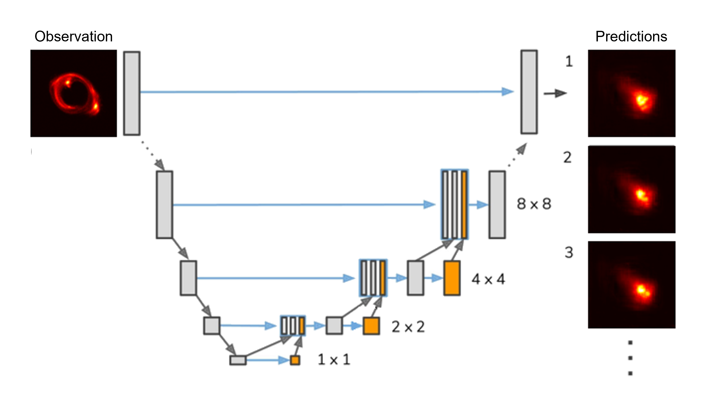
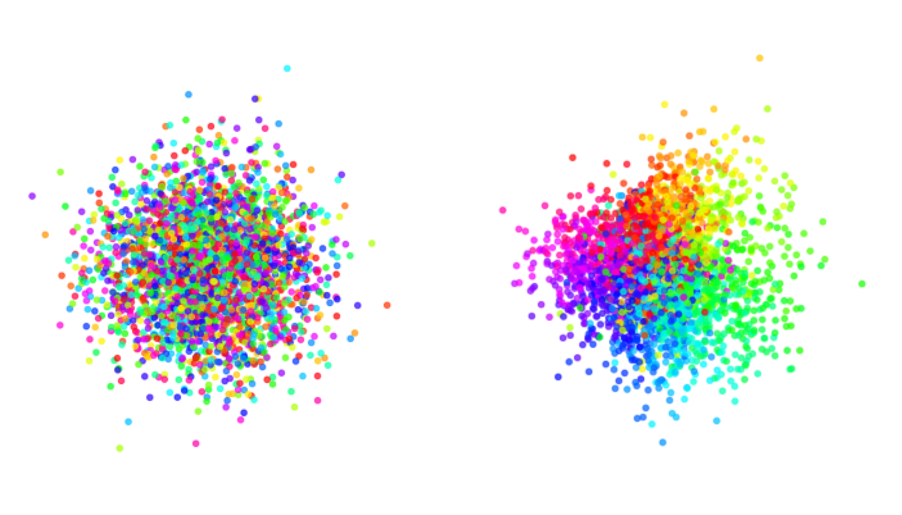

# ProbUNet-Tutorial

Tutorial on Probabilistic U-Nets, Including a Minimal PyTorch Implementation of the Hierarchical Probabilistic U-Net.

|       |       |
|                                :----:                                     |                                :----:                                     |
|                      **Part 1:** Source Reconstruction                       |                      **Part 2:** Rescue the Randomness                      |

Access Slides & Recording of the Talk Presented at the [KITP Program on Building a Physical Understanding of Galaxy Evolution with Data-driven Astronomy](https://datadrivengalaxyevolution.github.io/)

### Complementary Resources

1. [1806.05034](https://arxiv.org/abs/1806.05034) **Original Probabilistic U-Net Paper** (Kohl et al. 2018) + [GitHub Repo](https://github.com/SimonKohl/probabilistic_unet)
2. [1905.13077](https://arxiv.org/abs/1905.13077) **Original Hierarchical Probabilistic U-Net Paper** (Kohl et al. 2019) + [GitHub Repo](https://github.com/deepmind/deepmind-research/tree/master/hierarchical_probabilistic_unet)
3. [1903.10145](https://arxiv.org/abs/1903.10145) **Paper on KL Vanishing and Cyclical Beta Schedule** (Fu, Li, et al. 2019)
4. [1810.00597](https://arxiv.org/abs/1810.00597) **Paper on GECO Loss** (Rezende and Viola 2018)
5. [2302.03026](https://arxiv.org/abs/2302.03026) **Novel Method for Coverage Probability Test** (Lemos et al. 2023)
6. [Joseph Rocca](https://towardsdatascience.com/understanding-variational-autoencoders-vaes-f70510919f73) **Blog Post on Understanding Variational Autoencoders (VAEs)**
7. [Isaac Dykeman](https://ijdykeman.github.io/ml/2016/12/21/cvae.html) **Blog Post on Conditional Variational Autoencoders**
